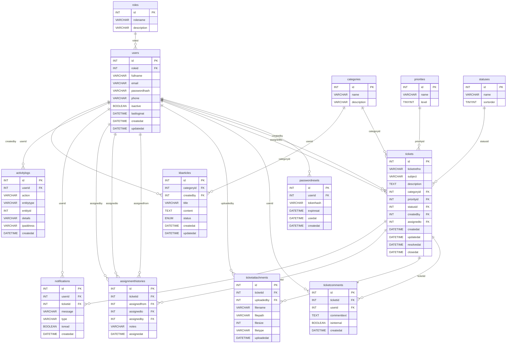
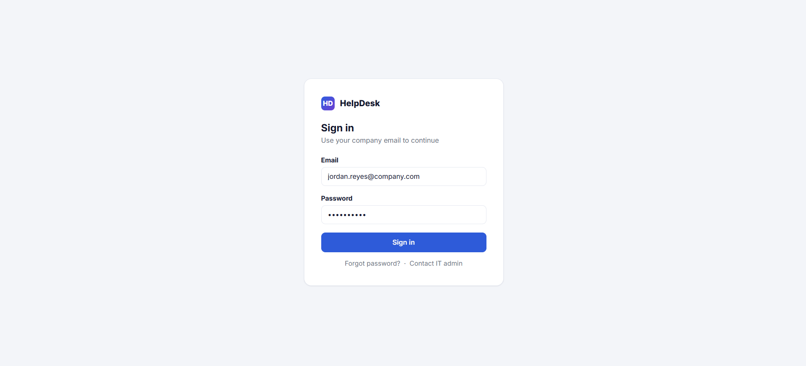
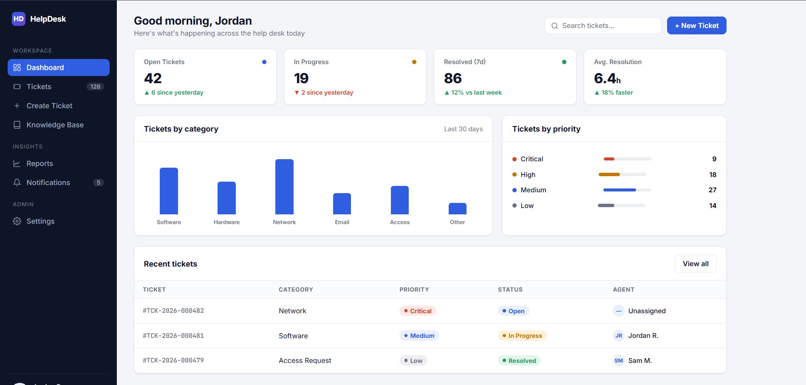
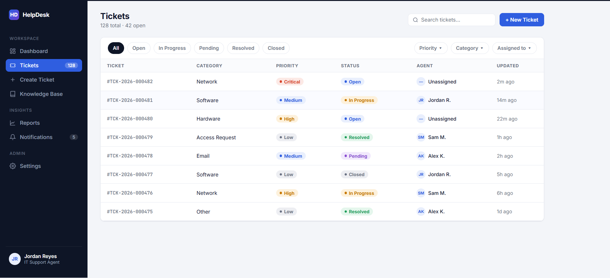
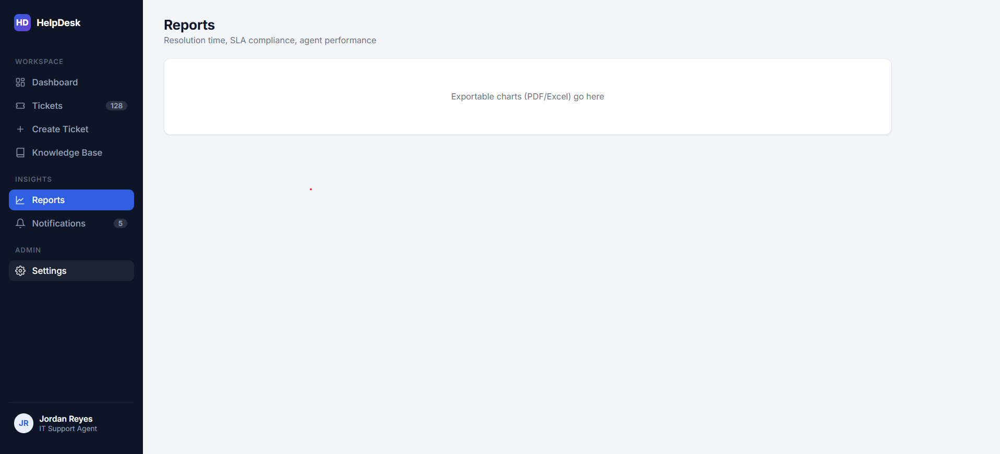

# Project Documentation

This folder contains the database schema, ERD, workflow diagrams, and UI
screenshots for the IT Help Desk and Ticketing Management System.

## Database Naming Rules

- Table names are plural.
- Every primary key column is named `id`.
- Table names and column names do not use underscores.

## Database Schema

- [GitHub schema copy](database_schema.sql)
- [Executable MySQL schema](../database/schema.sql)

## Entity Relationship Diagram

- [ERD image](ERD%20.jpg)
- [Draw.io source](ERD%20.drawio)

## Workflow Diagrams

- [Ticket Creation Workflow](Ticket%20Creation%20Workflow.jpg)
- [Ticket Assignment and Resolution Workflow](Ticket%20Assignment%20Resolution%20Workflow.jpg)
- [Admin Management Workflow](Admin%20Management%20Workflow.jpg)

## UI Screenshots

- [Log In](Log-In.png)
- [Dashboard](Dashboard.png)
- [Tickets](Tickets.png)
- [Reports, Settings, and Notifications](Reports-Settings-Notifications.png)

